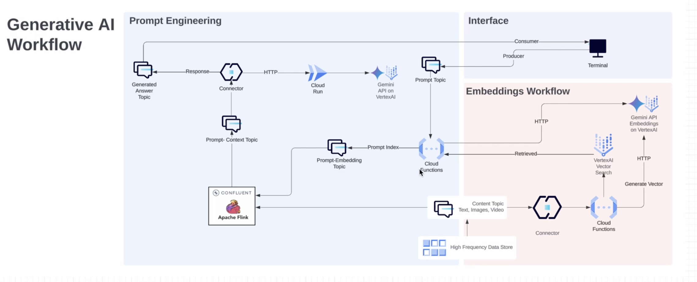

# genai-confluent-gcp-artifact
# Overview

This is the 2.0 version of what we did at current 2023 with GCP, where we built a streaming RAG pipeline powered by Flink SQL on confluent cloud for real time contextual processing on the other hand using Gemini's multimodality for Image+Text based question/answering chat pipeline for domain specific knowledge bots. References: [Architecture](https://lucid.app/lucidchart/ce1acdc5-08d1-4f26-88fb-f75c435331bc/edit?referringApp=google+drive&beaconFlowId=728bd107b5478196&invitationId=inv_ec0df969-af71-42e8-8b97-7040187b9dd9&page=hIEhqJj~tzIJ#), [Google Blog](https://cloud.google.com/blog/topics/partners/confluent-brings-real-time-capabilities-to-google-cloud-gen-ai), [Webinar](https://event.on24.com/wcc/r/4513309/FECC83DA71BA6716B67A5CF262D9C6B0), [Deck](https://docs.google.com/presentation/d/1enlFaFB9ft4893Y07pW2fi5cw1LvJyctG9l8w3Y0qKI/edit#slide=id.g23d1fe316c8_0_3960).

## Before you begin
Let's take a look at architecture to understand all the components



In the GCP-GenAI-Demo project the focus lies within the retail sector. The project showcases the potential of streaming data to enhance communication channels. Leveraging Google's advanced Language Model, Gemini, the project aims to contextualize responses effectively.

In the specific use case mentioned, the project aims to provide end-users with product recommendations or similar products based on the context derived from the available product catalog. This context could include various factors such as user preferences and previous interactions.

For example, if a user is browsing a particular product in the catalog, the system can use Gemini to analyze the product description or user query and provide similar product recommendations. These recommendations can be delivered to the user.


### Components
Gemini API: This is Google's flagship Language Model used for generating responses based on the user's preferences, expected weather conditions, and their desired colors.

Cloud Functions: These are used to generate embeddings and vectors, and to write the core business logic for generating context embedding as well as prompt embedding.Also search vector db to get related embeddings for prompt embedding

Flink SQL: This is used to join prompt and context table data and insert session history.

Cloud Run App: This is a fast api app deployed with the Vertex AI SDK to send requests to gemini API with the acquired related context data for a prompt and generate a text like response for the user.

Connectors: These include two Sink Connector to Cloud Functions and an HTTP Sink Connector to send requests to the Cloud Run App app.


### Architecture
The architecture of the gcp-genai-demo project involves a series of steps:

Data Generation: The process begins with the generation of product info data.

Context Creation: The context is created using Cloud Functions, which generate embeddings and vectors and context genrated is stored into the vector db.

Prompt Generation: Prompts are generated and their embeddings are created. A query is run to find the top 5 matching indexes.

Integration: A HTTP connector is integrated to send a request to the Cloud Run app and submit the response to the Generated answer topic.

Response Generation: The Cloud Run app, developed and deployed with the Gemini API, generates a text based response for the end user.

Before you start working with this project, ensure you have access to Google Cloud and Confluent services. Familiarize yourself with Google's Gemini API and Vertex AI SDK. Also, ensure you have the necessary permissions to deploy applications and integrate connectors


## Pre-requisites
- User account on [Confluent Cloud](https://www.confluent.io/confluent-cloud/tryfree)
- Local install of [Terraform](https://www.terraform.io) (details below)
- Env ,Cluster and Schema registry setup on confluent cloud env

## Installation (only need to do that once)

### Install Terraform
```
brew tap hashicorp/tap
brew install hashicorp/tap/terraform
brew update
brew upgrade hashicorp/tap/terraform
```


### Authenticate your Google Cloud account
```
gcloud auth login

gcloud auth application-default login  

```


### Create VectorSearch Index Endpoint on your Google Cloud account
Refernce : https://cloud.google.com/vertex-ai/docs/vector-search/deploy-index-vpc


## Provision services for the demo

### Set environment variables
- Create file `.env` from `.env_example`
```
CONFLUENT_CLOUD_API_KEY=<SPECIFY YOUR CONFLUENT_CLOUD_API_KEY >
CONFLUENT_CLOUD_API_SECRET=<SPECIFY YOUR CONFLUENT_CLOUD_API_SECRET >
CC_ENV_ID=<SPECIFY YOUR ENVIRONMENT ID>
CC_SR_ID=<SPECIFY YOUR SCHEMA REGISTRY ID>
CC_CLUSTER_ID=<SPECIFY YOUR KAFKA CLUSTER ID>
PROJECT_ID=<SPECIFY YOUR GCP PROJECT_ID>
INDEX_NAME=<SPECIFY YOUR GCP INDEX_NAME>
REGION=<SPECIFY YOUR REGION>
INDEX_ENDPOINT=<SPECIFY YOUR INDEX_ENDPOINT>
DEPLOYED_INDEX_ID=<SPECIFY YOUR DEPLOYED_INDEX_ID>
```

### Setup the env for demo 
- Run command: `./demo_start.sh`

The Terraform code will also create resources onto your confluent cloud and gcp account.


## Terraform files
- `vars.tf`: Main system variables (change it as needed)
- `providers.tf`:
  - confluentinc/confluen
  - hashicorp/external (To read env variables)
- `main.tf`: 
  - Confluent Cloud Environment
  - Schema Registry
  - Apache Kafka Cluster
  - Service Accounts (app_manager, sr, clients)
  - Role Bindings (app_manager, sr, clients)
  - Credentials / API Keys (app_manager, sr, clients)
- `connectors.tf`:
  - Service Accounts (Connectors)
  - Access Control List
  - Credentials / API Keys
  - Create Kafka topics for the DataGen Connectors
  - DataGen Connectors
- `data_portal.tf`:
  - Create tags and business metadata after creation of KSQL queries.
  - Create tags and business  bindings for the topics


